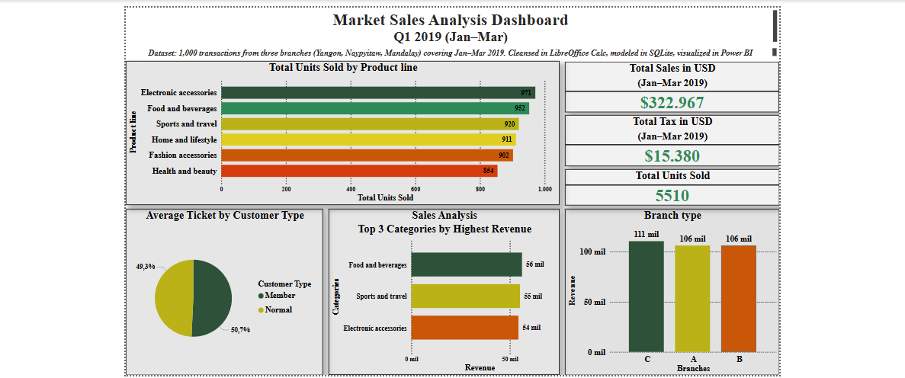

# 🛒 Supermarket Sales Dashboard (Power BI)

Interactive Power BI professional dashboard of Q1 2019 supermarket sales - data cleansing in LibreOffice Calc, modeling in SQLite, analysis with DAX and visuals designed for decision‑makers.

**Interactive analysis of supermarket retail sales in the first quarter of 2019**  

## 📊 Project overview

This project offers a comprehensive interactive Power BI dashboard that analyzes 1,000 real transactions from a supermarket chain with three branches (Yangon, Naypyitaw, and Mandalay) between January and March 2019. It shows the data processing from start to finish:

 **Dataset download** from Kaggle:  
   https://www.kaggle.com/datasets/willianoliveiragibin/market-sales-data

## 🖼️ Dashboard preview

## 🛠 Tools Used

- **LibreOffice Calc** – Data cleaning & column creation
- **SQLite (via Anaconda CLI)** – Data modeling & SQL queries
- **Power BI Desktop** – Power Query transformation + DAX visual analysis

## 📁 Project structure

market-sales-dashboard/
│
├── docs/                            # Dashboard files
│   ├── Market_sales_dashboard.pdf   # Exported Power BI report (PDF)
│   └── Market_sales_dashboard.pbix  # Power BI project file
│
├── images/                          # Visual resources
│   └── Market_Sales_Dashboard.png   # Screenshot preview of the dashboard
│
├── README.md                        # Main documentation file
└── LICENSE                          # MIT license for open use

## 📈 Key Business Metrics

| KPI                     | Value      |
|-------------------------|------------|
| Total Sales (USD)       | $322,967   |
| Tax Collected (USD)     | $15,380    |
| Units Sold              | 5,510      |
| Avg. Ticket Value       | $322.97    |

Highlights:
- Branch C leads with $111K in sales
- Top categories: Food & Beverages, Sports & Travel, Electronic accessories
- Customer type: Member
- Total Units Sold by Product line

## 📊 Analysis and Interpretation

This analysis allows a supermarket to:

- Identify the most profitable product lines by revenue and units.
- Compare branch performance and make investment decisions.
- Observe month-to-month sales growth (trends).
- Analyze behavior by customer type (loyalty).
- Evaluate the average ticket for campaigns or price adjustments.

### What was detected in this case?

- Branch **C** leads in sales (more than $111,000).
- **Member** customers generate slightly higher tickets → useful for loyalty.
- Categories such as **Food & Beverages** and **Electronic Accessories** stand out in revenue and volume.
- The analysis allows **promotions, stock, and campaigns to be adjusted** according to actual behavior.

## ℹ️ Notes

This project was created as a personal initiative to reinforce my technical skills in real-world data workflows. I executed the entire process from raw data to visual insights, including cleansing, modeling, and dashboard design.

I'm sharing it publicly to demonstrate my capabilities as a data analyst and my commitment to continuous learning.

